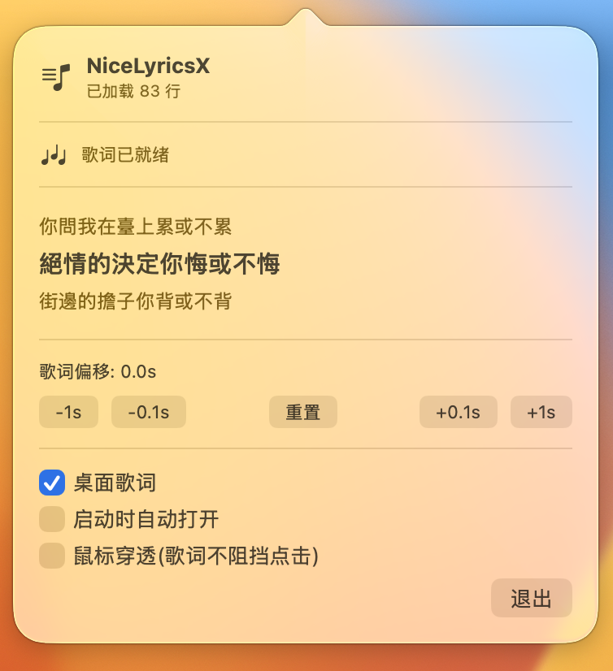

# NiceLyricsX

> 菜单栏常驻的 macOS 歌词应用,跟着 Apple Music 一起呼吸。

NiceLyricsX 不是一个独立播放器 —— 它住在你的菜单栏,听 Apple Music 播什么,就把它当前一行、上一行、下一行同步高亮投到桌面上。无需切换播放源,无需登录,无需订阅,装上就能用。

---

## 截图

### 桌面悬浮歌词


### 菜单栏下拉面板(配置 / 偏移 / 开关)



---

## 下载

- **macOS 16 (Tahoe) 及以上**
- 通用二进制 (Apple Silicon)
- 推荐从 [Releases 页面](../../releases/latest) 下载 `NiceLyricsX-1.0.0.dmg`

### 1. 安装

1. 双击挂载 `NiceLyricsX-1.0.0.dmg`
2. 把 **NiceLyricsX** 拖进 **Applications** 文件夹
3. 在 **启动台** 或 **Applications** 里双击运行

### 2. 首次启动 — 给自动化权限

第一次跑起来,系统会弹一个权限框:

> "NiceLyricsX" 想控制 "Music"。

点 **好**。如果不小心点错了:

> 系统设置 → 隐私与安全性 → 自动化 → 找到 NiceLyricsX,把 **Music** 勾上。

> ⚠️ 这条权限走的是 macOS TCC,不是弹一次就完事。如果你的 Mac 启用了防火墙或者家长控制,需要管理员先解锁。

### 3. 打开 Apple Music,放首歌

菜单栏右上角会出现一个 **♪** 图标,点开就是歌词面板。系统应该已经自动在读你正在听的歌了。

---

## 新手引导

| 你想做的事 | 在哪里点 |
| --- | --- |
| 看当前这行歌词 | 菜单栏图标 → 弹出的面板里就能看到 |
| 把歌词投到桌面 | 弹出的面板里把 **桌面歌词** 打开 |
| 歌词比唱快了/慢了 | 弹出的面板里按 **±0.1s** 或 **±1s** 微调 |
| 调整完想让所有歌曲都按这个偏移来 | 偏移是全局的,改一次到处生效,自动保存 |
| 桌面歌词挡住了别的东西 | 弹出的面板里把 **鼠标穿透** 打开 |
| 每次开机自动开歌词窗口 | 弹出的面板里把 **启动时自动打开** 勾上 |
| 不想用了 | 弹出的面板里点 **退出** |

> 桌面歌词窗口是可以**拖动**的,位置会自动记住,换 4K 屏 / 外接显示器不会破相。

---

## 特性

- **菜单栏常驻**:没有 Dock 图标,不出现在 ⌘+Tab,安静地待着
- **双数据源歌词**:优先 [LRCLIB](https://lrclib.net)(欧美 + 流行中文),搜不到时自动回退到 [网易云音乐](https://music.163.com)(中文 / 抖音 / 翻唱),基本能找到 90% 的歌
- **本地缓存**:第一次搜过的歌会缓存到 `~/Library/Application Support/NiceLyricsX/lyrics/`,换台机器也可以复制过去
- **同步高亮**:桌面歌词窗口显示当前行 + 上一行(浅) + 下一行(浅),行级时间戳 + LRC 内嵌翻译都支持
- **±10 秒偏移微调**:适用于 LRC 时间戳不准的情况
- **多屏 / 高分屏适配**:窗口位置按 `[0, 1]` 比例存,4K / 5K / 外接显示器切换不会把歌词扔到屏外
- **本地优先**:Apple Music 的播放信息完全走 AppleScript 在本机读,歌词走 HTTPS 拉 LRCLIB / 网易云,**没有第三方账号、没有后端、没有 telemetry**

---

## 常见问题

<details>
<summary><b>菜单栏图标不出现?</b></summary>

- 确认 Apple Music 至少启动过一次(系统需要注册 media player)
- 看一眼 **活动监视器** 里有没有 NiceLyricsX 进程在跑
- 如果有 macOS 的「聚焦」正在占用,试试先 quit
</details>

<details>
<summary><b>歌词一直没出来,状态显示"未找到歌词"?</b></summary>

- LRCLIB 主要是英文 + 海外中文流行,网易云 fallback 在大多数情况下能补上
- 个别翻唱 / DJ 版 / 抖音新歌可能两边都没有,等几天通常会被社区补录
- 检查网络:macOS 第一次跑新装的应用会弹「是否允许联网」,没点过的话去 **系统设置 → 网络 → 防火墙** 看一眼
</details>

<details>
<summary><b>歌词比实际演唱快 / 慢?</b></summary>

打开菜单栏面板,按 `±0.1s` 一格格调到对为止。偏移会全局保存,不需要每次调。
</details>

<details>
<summary><b>桌面歌词挡住了视频 / 浏览器?</b></summary>

面板里把 **鼠标穿透** 打开 —— 歌词窗口就只是"看"得见,鼠标事件会穿透到下层,不会拦截点击。
</details>

<details>
<summary><b>支持 Spotify / QQ 音乐 / 网易云客户端 / 汽水音乐 / 洛雪音乐吗?</b></summary>

**不支持**。NiceLyricsX 只读 Apple Music 和 iTunes(两者底层是同一个 media player 框架)。如果你的主听歌 App 是其它,本应用没法读它的播放状态。
</details>

<details>
<summary><b>支持逐字卡拉 OK(每个字单独高亮)?</b></summary>

不支持。本应用只支持 LRC 格式的**行级**时间戳。Apple Music 自己的动态歌词是逐字时间戳(`<00:01.23>` 行内标签),目前没有读取通道,只能等 LRC 社区整理后从 LRCLIB 拿。
</details>

<details>
<summary><b>为什么是 macOS 16+?</b></summary>

- 用了 Swift 6 严格并发、SwiftUI 新 API
- 现在 Apple Music 在 macOS 上被推到了比 iTunes 更高的系统级集成度,只有 macOS 16+ 上读播放状态的 API 才稳定
- 想要 macOS 15 支持的话,回退一版 Swift 5.x 即可,代码层面只是几行配置
</details>

---

## 从源码编译

只在你**想改代码**或者你 Mac 不是 Apple Silicon 时需要。普通用户直接下 DMG 就行。

### 准备

- macOS 16+
- Xcode 16+ / Swift 6.2+
- Git

### 命令行

```bash
git clone https://github.com/SapientialM/NiceLyricsX.git
cd NiceLyricsX

# 用 Xcode 打开
open LyricsMenu.xcodeproj
# Cmd+R 运行

# 或直接用 xcodebuild
xcodebuild -project LyricsMenu.xcodeproj -scheme NiceLyricsX \
           -configuration Release -derivedDataPath build build
# 产物:build/Build/Products/Release/NiceLyricsX.app
```

### 跑测试

```bash
swift test
```

41 个单元测试,覆盖:
- LRC 解析(标准 / 多时间标签 / 行内翻译 / ID 标签 / Windows 行尾)
- Lyrics 二分查找 + 偏移
- PlaybackState 状态机 + 容差比较
- LRCLIB / 网易云 API 响应解码

---

## 项目结构

```
NiceLyricsX/
├── LyricsMenu/                              # 主应用
│   ├── App.swift                            # @main + AppDelegate
│   ├── MenuBarView.swift                    # 菜单栏 status item + SwiftUI 面板
│   ├── DesktopLyricsWindow.swift            # 桌面悬浮歌词(NSPanel + 毛玻璃)
│   ├── MusicPlayer/
│   │   ├── PlaybackInfo.swift               # 播放状态数据(起播时间戳)
│   │   ├── MusicPlayerProtocol.swift        # 播放器协议 + 多源代理
│   │   ├── AppleMusicPlayer.swift           # Apple Music / iTunes (AppleScript)
│   │   └── MediaRemoteLoader.swift          # MediaRemote 私有 framework dlopen
│   ├── LyricsService/
│   │   ├── LyricsLine.swift                 # LyricsLine + Lyrics
│   │   ├── LyricsParser.swift               # LRC / LRCX 解析
│   │   ├── LRCLIBClient.swift               # LRCLIB API 客户端
│   │   ├── NetEaseClient.swift              # 网易云 API fallback
│   │   ├── LyricsProvider.swift             # 缓存 + 双源统一入口
│   │   └── LyricsEngine.swift               # 切行 + 精准 Task.sleep 调度
│   ├── Utils/
│   │   └── UserDefaults+Extension.swift     # 类型安全持久化 + 屏幕位置因子
│   └── Resources/
│       ├── Info.plist                       # LSUIElement=true
│       ├── NiceLyricsX.entitlements         # 必要权限
│       └── Assets.xcassets
├── Tests/                                    # 单元测试
├── LyricsMenu.xcodeproj
├── Package.swift                             # SPM 清单
├── CHANGELOG.md
└── LICENSE
```

### 关键设计

- **wall-clock 起播时间**:`PlaybackState.playing(start: Date)` 用墙钟记录起播时刻,`state.time = now - start` 零延迟,无需内部计时器
- **精准切行**:`LyricsEngine` 不每帧 poll,而是计算"距离下一行多久",用 `Task.sleep` 提前 50ms 唤醒,CPU 占用接近 0
- **位置比例因子**:`NSScreen.positionFactor` 把窗口坐标存成 `[0, 1]` 比例,4K / 多屏切换不破相
- **双源 fallback**:LRCLIB noResult 才走网易云,其它错误直接抛(避免掩盖真问题)

---

## 隐私

- 读取的本地信息:Apple Music 当前曲目(AppleScript,系统 TCC 授权,不走网络)
- 联网请求:仅 LRCLIB / 网易云 API(`https://lrclib.net` / `https://music.163.com`)
- **不收集任何使用数据、不连任何后端、不需要账号**

歌词缓存本地存储,你想清就清:

```bash
rm -rf ~/Library/Application\ Support/NiceLyricsX/lyrics/
```

---

## 已知限制

- 不支持逐字卡拉 OK 效果
- 不支持 Spotify / QQ 音乐 / 网易云客户端 / 其它第三方播放器
- macOS 26 上 MediaRemote 私有 framework 异步 callback 有 bug,目前走 AppleScript 路径(MediaRemote 的类型和调用代码保留了,等 Apple 稳定后能一键恢复)
- 极个别歌曲 LRCLIB 和网易云都没有歌词(用户上传翻唱、抖音新歌等)

---

## 致谢

- [LyricsX](https://github.com/ddddxxx/LyricsX) — 架构设计灵感来源
- [LRCLIB](https://lrclib.net) — 社区维护的 LRC 歌词库
- [网易云音乐](https://music.163.com) — 中文歌词 fallback 来源

## 许可

MIT,见 [LICENSE](LICENSE)。
